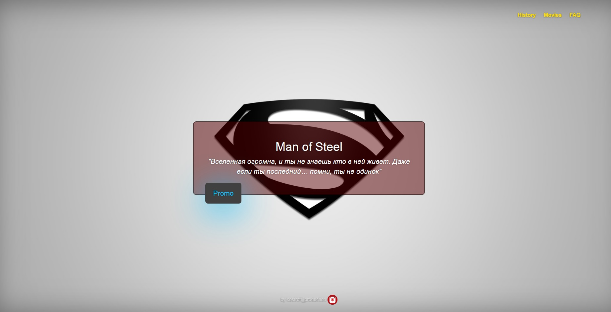
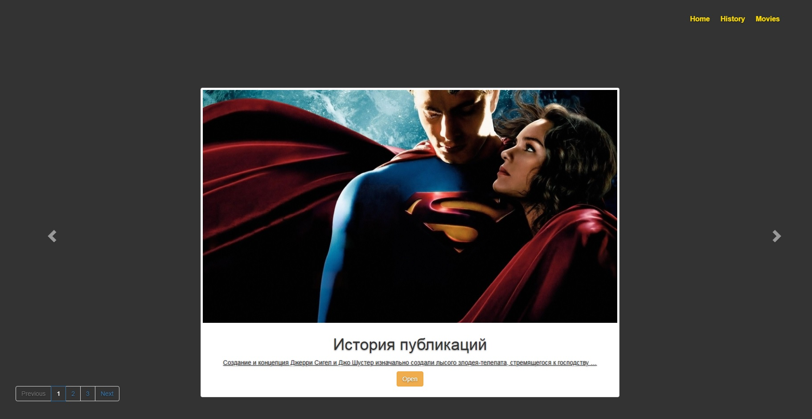

# Superman
### О приложении
Приложение «Superman» является динамическим сайтом, посвященному герою DC Superman.  
К сайту подключено администрирование через установку прав доступа для пользователей. 
Администратор сайта может создавать, обновлять и удалять посты, так же 
отвечать в разделе FAQ. 
### Установка.
Предварительно установив все зависимости
и Docker, загрузите приложение на свой сервер через гит.  
`git clone https://github.com/kostroff-production/site-Superman.git`  
Активируем файл `entrypoint.sh` из директории с файлом.  
`chmod +x ./entrypoint.sh` 
Сделайте сборку контейнера из директории с Docker файлом. 
`docker build .` 
Далее собираем docker-compose. 
`docker-compose up -d –build`
После приложение должно быть доступно, если все зависимости были установлены корректно. 
## Разделы сайта
### Стартовая страница
Стартовая страница выполнена в минималистичном стиле. 
Основная кнопка на странице - это кнопка “Promo”, при нажатии на которую запускается ролик о 
Superman. 

### Раздел Историй
В разделе собраны известные статьи и истории о герое, выполненные в виде слайдов, которые можно открыть и почитать.
 
 

 
 

&nbsp;&nbsp;&nbsp;&nbsp;&nbsp;&nbsp;&nbsp;&nbsp;&nbsp;&nbsp;
&nbsp;&nbsp;&nbsp;&nbsp;&nbsp;&nbsp;&nbsp;&nbsp;&nbsp;&nbsp;

### Раздел Фильмографии.
В раздел добавлены несколько сериалов и фильмов о Superman с их кратким описание и кнопкой просмотра. 
При нажатии на кнопку просмотра пользователь будет перенаправлен на сайт Кинопоиска.
 
 

 
 
&nbsp;&nbsp;&nbsp;&nbsp;&nbsp;&nbsp;&nbsp;&nbsp;&nbsp;&nbsp;
&nbsp;&nbsp;&nbsp;&nbsp;&nbsp;&nbsp;&nbsp;&nbsp;&nbsp;&nbsp;
&nbsp;&nbsp;&nbsp;&nbsp;&nbsp;&nbsp;&nbsp;&nbsp;&nbsp;&nbsp;
&nbsp;&nbsp;&nbsp;&nbsp;&nbsp;&nbsp;&nbsp;&nbsp;&nbsp;&nbsp;
&nbsp;&nbsp;&nbsp;&nbsp;&nbsp;&nbsp;&nbsp;&nbsp;&nbsp;&nbsp;
&nbsp;&nbsp;&nbsp;&nbsp;&nbsp;&nbsp;&nbsp;&nbsp;&nbsp;&nbsp;

### Раздел Ответов на вопросы.
В разделе FAQ пользователи через специализированную форму могут задавать свои вопросы о сайте и вносить предложения. 
Администратор сайта в последующем отвечает на вопросы пользователей, просмотреть ответ можно нажав на вопрос.
 
 

